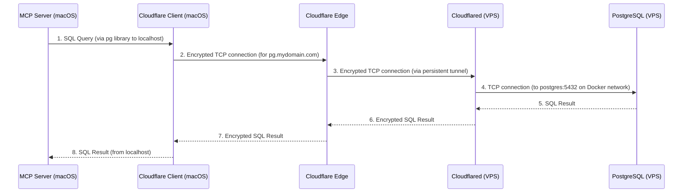

# Homelab MCP

MCP server for helping with managing homelab running on a VPS.

## Usage

- Requires [Bun](https://bun.sh/)
- Install: `bun install`
- Build: `bun run build`

Add the following to your `mcp.json`:

```json
{
  "homelab-mcp": {
    "name": "Homelab MCP",
    "command": "node",
    "args": [
      "<PATH_TO_THIS_REPO>/build/index.mjs"
    ],
    "env": {
        "VPS_HOST": "",
        "VPS_PORT": "",
        "VPS_USERNAME": "",
        "VPS_PRIVATE_KEY_PATH": "",
        "HOMELAB_DIR": "",
        "POSTGRES_USER": "",
        "POSTGRES_PASSWORD": "",
        "POSTGRES_HOST": "",
        "POSTGRES_PORT": "",
        "POSTGRES_DATABASE": "",
        "POSTGRES_SCHEMA_PATH": ""
    }
  }
}
```

## Development

- Watch: `bun run build:watch`
- Inspector: `bun inspector`

## Postgres Connection Flow via 


